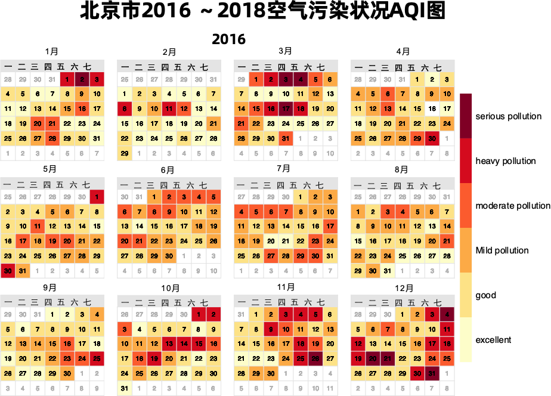
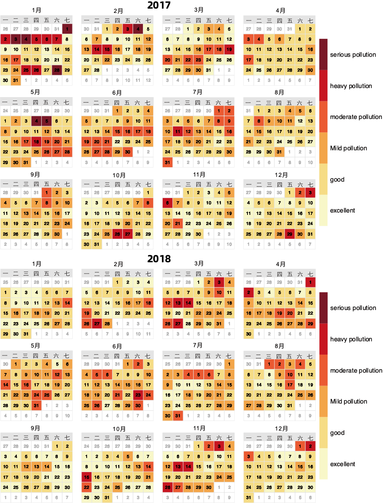
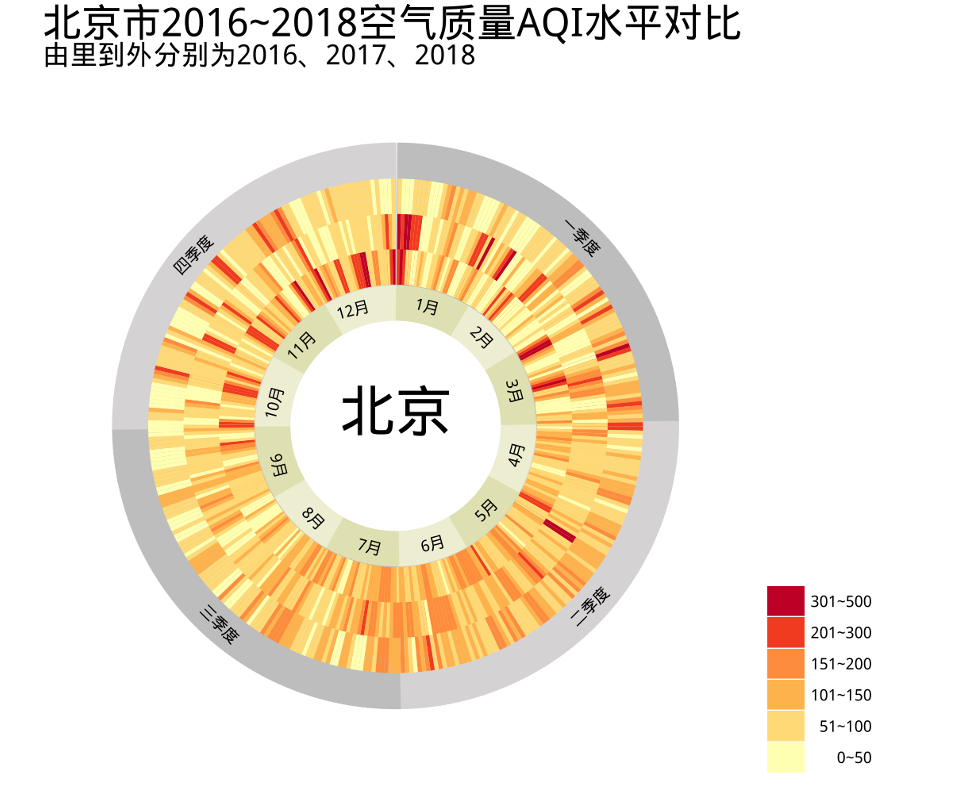

# Beijing Air Pollution Index time seires modeling

> Hi there! I am Jace. This was my final project of `Statistical Computation` that scored 95/100. It's taught by [Professor Feng Li](https://feng.li/) when I major *Applied Statistics* at Central University of Finance and Economics(CUFE) in 2019 spring.

All details were originally written in [report_Chinese.pdf](report_Chinese.pdf), and translated(but curtailed) in [report_English.pdf](report_English.pdf)

## Data Visualization

- **Annual talendar heat map of AQI in Beijing from 2016 to 2018:**

    
    

- **Cross-sectional monthly and quarterly charts from 2016 to 2018:**

    